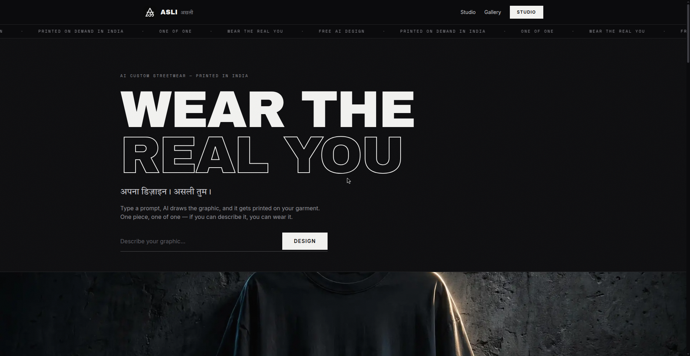
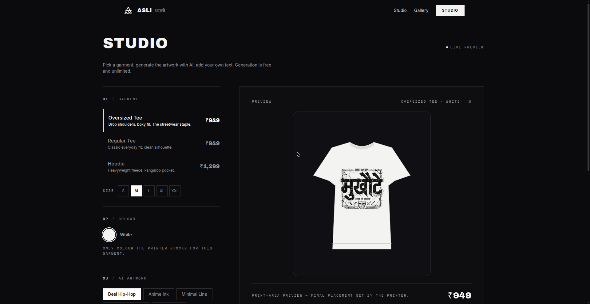

<div align="center">

# ASLI
### असली — Wear the real you. — AI custom streetwear, printed on demand in India


**AI custom streetwear — made in India**

[Live Site](https://asli-delta.vercel.app/) • [Studio](https://asli-delta.vercel.app/studio) • [Gallery](https://asli-delta.vercel.app/gallery) • [GitHub](https://github.com/adityapratap0077-cloud)

</div>

---

ASLI (असली — "real, authentic") is a prompt-to-print streetwear studio. Pick a garment, describe your graphic or tap a style preset, and AI draws the artwork free in seconds. Preview it live on the garment in your color and size, add custom Hindi or English text, then order. Printed on demand in India — one piece, one of one.

## Screenshots

<div align="center">



*Landing — "WEAR THE REAL YOU" typographic hero, AI custom streetwear*



*Studio — garment picker, live mockup preview, style presets*

</div>

---

## How it works

```
prompt → AI artwork → live garment mockup → manual UPI / PayPal order → Qikink print-on-demand
```

1. **Describe** — type a prompt ("desi hip-hop lion with Hindi lettering") or tap a style preset.
2. **Generate** — the AI draws the graphic free, in seconds, unlimited tries. Content moderation runs on every generation.
3. **Preview** — the live mockup shows the print on your garment in the exact color and size, with print-style blending and a custom Devanagari-capable text layer. Download the PNG mockup straight from the studio.
4. **Order** — pay manually via UPI (India) or PayPal (international). Orders land in Supabase with a localStorage fallback, so no order is ever silently lost.
5. **Print** — the owner verifies each payment by hand, forwards the order to Qikink, and the piece is printed only after you order. Nothing is pre-printed, nothing fake.

## Features

- **AI artwork studio** — free generation with 5 curated style presets: Desi Hip-Hop, Anime Ink, Minimal Line, Hindi Typography, Dark Gothic
- **Live garment mockup** — per-product colors matched to real printer stock, size picker, custom Hindi/English text layer, PNG download
- **Starter gallery** — "Fresh Drops" from the vault; open any in the studio and make it yours
- **Honest manual payments** — UPI for India, PayPal for international; payment-pending states, no fake success screens
- **Owner dashboard** — verify payments, forward orders to Qikink, track print status
- **Real Qikink integration** — sandbox-verified token + order-create pipeline, SKU-mapped products, DTF print
- **Moderation + human review** — generation blocklist on every prompt; nothing prints without a human sign-off
- **Polices page** — shipping, returns, and honest pricing terms in plain language

## Pricing

AI design is free, forever. You pay for the garment and the print.

| Product | Fit | Price |
| :--- | :--- | :--- |
| Oversized Tee | Drop shoulders, boxy fit | ₹949 |
| Regular Tee | Classic everyday fit | ₹949 |
| Hoodie | Heavyweight fleece, kangaroo pocket | ₹1,299 |

Prices are set in `lib/catalog.ts` and matched to real Qikink SKUs — colors are restricted to what the printer actually stocks.

---

## Design System

Minimal monochrome — the type does the talking.

### Color Palette

| Color | Hex | Usage |
| :--- | :--- | :--- |
| Void Black | `#0B0B0D` | Background |
| Warm White | `#F2F2F0` | Primary text, type |
| Stone | `#B9B9BD` | Secondary text |
| Muted | `#8F8F96` | Tertiary |
| Hairline | `#5A5A61` | Rules, borders |
| Panel | `#2A2A30` | Cards, preview frames |

### Typography

- **Display:** oversized uppercase type, solid + outline treatments — WEAR THE REAL YOU
- **Mono:** tracked-out labels — `01 — PROCESS`, `PRINT-AREA PREVIEW`, numbered sections
- **Script accent:** Devanagari — `अपना डिज़ाइन। असली तुम।`

---

## Tech Stack

`Next.js / TypeScript / Tailwind CSS / Supabase / Qikink API / Vercel`

Orders API (`/api/orders`), generation endpoint (`/api/generate`), Qikink order-forward + test routes (`/api/qikink/*`), Supabase order backend with a labelled localStorage fallback.

## Getting Started

```bash
git clone https://github.com/adityapratap0077-cloud/asli.git
cd asli
npm install
npm run dev
```

Payment credentials are env-overridable (`NEXT_PUBLIC_OWNER_UPI_ID`, `NEXT_PUBLIC_PAYPAL_ME_URL`).

## Deploy

Push to `main` — Vercel auto-deploys production.

---

## Author

**Aditya Pratap** — Creative Technologist
Gorakhpur, India — github.com/adityapratap0077-cloud

## License

MIT © Aditya Pratap
